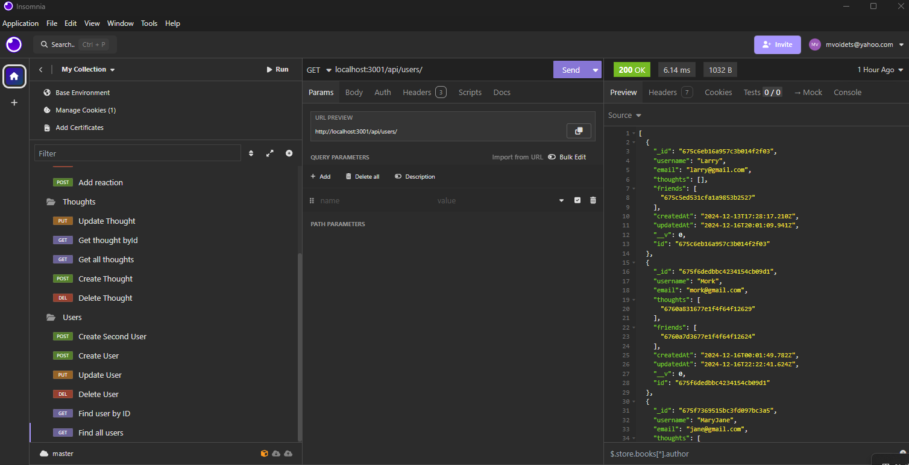

  # Title
   BlogIt
   

  ## Table of Contents

  - [Description](#description)
  - [Design](#design)
  - [Install](#install)
  - [Contributor](#contributor)
  - [License](#license)
  - [Questions](#questions)

  ## Description

   A user can be added, deleted and modified. Once a user is added you can add a friend, a thought and a reaction to a thought. This is done using Insomnia

  ## Design

    To work with Mongoose and Insomnia, api routes.

https://drive.google.com/file/d/1MnOupheOvQofUXKSFrro840rF7uOZb1v/view

  ## Install

    npm run start, then access via Insomnia

  ## Contributor

    mvoidets, tutors and google

  ## License

    This is not licensed  

  ### Questions

  If you have any questions, please contact me at: [mvoidets@yahoo.com] (mailto:mvoidets@yahoo.com). 

  My GitHub profile is [mvoidets](https://github.com/mvoidets/blog).

  Thank you for visiting my repository!